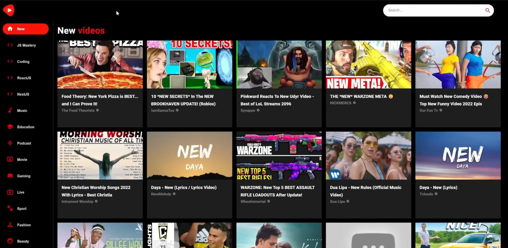

# youtube-clone
## What is this project about?
This JSM Media Project is a Youtube Clone that has some of the features that Youtube has. Like a feed, search bar, channel pages and video pages.
I've used React.js and Material UI to build this clone.

### Preview

### How can I run this project?

First, you have to create an accout on [RapidAPI](https://rapidapi.com/) and subscribe [Youtube V3](https://rapidapi.com/ytdlfree/api/youtube-v31?utm_source=youtube.com%2FJavaScriptMastery&utm_medium=referral&utm_campaign=DevRel) to this API to get an API key.
After copying the key, you have to paste it on .env folder, and with that, just run __npm install__ and __npm run dev__ to run the application.
